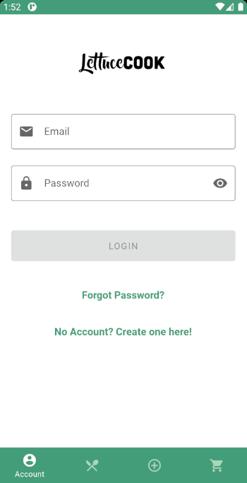
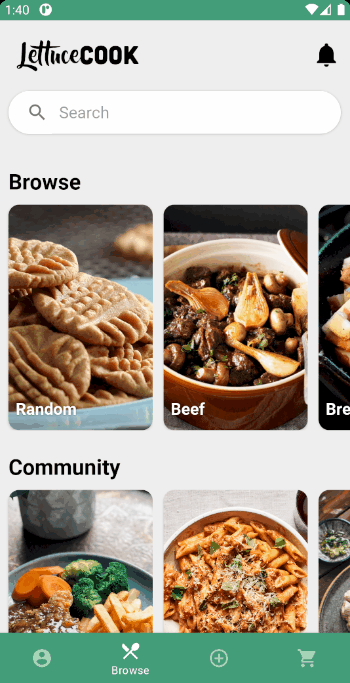
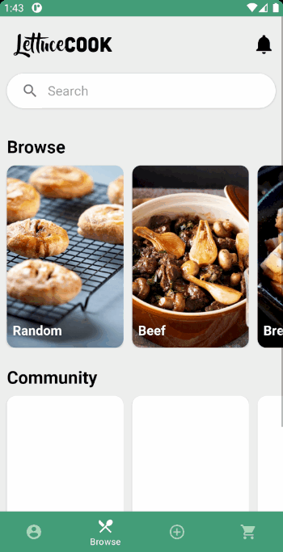
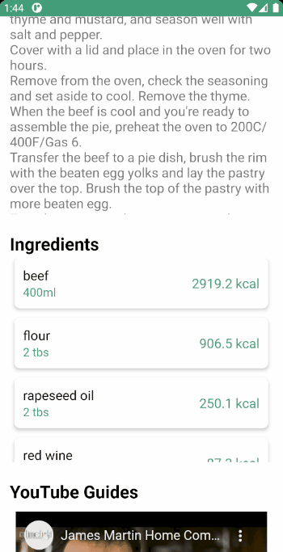
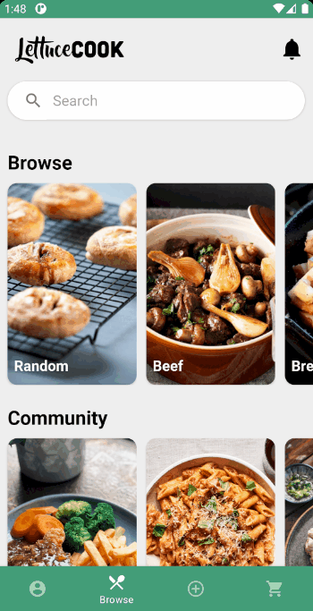

# LettuceCook
LettuceCook - Recipe Meal App  
Ngee Ann Polytechnic ICT Year 2 Sem 1 - MAD Assignment
## Team Members ##
**Ee Jun Kai Julian** - S10202587  
**Xavier Ang Yan Jun** - S10203108  
**Chew Kah Seng** - S10208180  

## Description ##
LettuceCook is a recipe meal application which aims to assist and inspire users to cook! Features such as account-based shopping lists allow users to have a more convenient way of gathering the needed ingredients. Custom created recipes allow users to publish and share with other users of the application!

## Design Process ##
* **Beginners**
    * Beginners may want to use our app to check out a wide variety of recipes to choose from and view the details regarding them to start cooking their dishes.
    * Through the use of the shopping list, beginners can look out for certain ingredients needed to cook their dishes.
    * Beginners can also view YouTube videos that can guide them through the process of creating the dish they have chosen.

* **Regular Cooks**
    * Regular Cooks may want to spice up their dishes by looking up other recipes regarding their normal dishes to improve them.
    * Regular Cooks may use our app to set notification reminders to help them plan out their next meal to cook.

* **Diet Conscious Users**
    * Diet conscious users can look up the recipe nutritional information or calories intake regarding their dishes.

* **Creative and Experimental Cooks**
    * Creative Cooks can also use our app to keep track of their numerous experimental recipes.
    * Creative Cooks may want to share and publish their recipes with the LettuceCook community.

## Roles & Contributions ##
**Ee Jun Kai Julian** - Custom Recipes
* Create Custom Recipes
* Featured Meal
* Favourites List

**Xavier Ang Yan Jun** - API Integrator
* Implement Meal API
* Browser (Home Screen)
* Implement CalorieNinjas API
* Recipe Calories Indicator
* Nutritional Information

**Chew Kah Seng** - UI & Main features
* Account Login/Create
* Navigation Bar
* Recipe Details
* ShoppingList
* App Icon
* UI Styling
* Recipe Sharing 
* Notification Reminder
* Firebase integration

## Features ##
These are the current features and pages of our mobile app as well as the additional features we plan to add in the future.
### Existing Features ###
- **General**
    - Login/Create Account
    

    
    

    - Bottom Navigation bar w/ Login/Account, Home, Create Recipe, Shopping List
    

        
    

    - Notifications
    

        
    

    - Calories Information
    - Shown beside ingredients when viewing recipes including custom recipes
    - Nutritional values information
    - Shown when user clicks on each individual ingredient
    

    
    

- **Home**:
    - Search Meals
    

    
    - Browse Meals
    - Community Meals - Shown when users publish their custom recipes
    

    

- **Account**:
    - View Favourites List
        - Add meal recipe to favourites when viewing recipe details
    

     
    - View Recipes List
    &nbsp;• Create custom recipes with gallery images
    &nbsp;• Add recipe name
    &nbsp;• Add recipe ingredients
    &nbsp;• Add recipe instructions
    - Publish & Share custom recipe
    

    
    - View Shopping List
    - Add any meal recipe ingredients to shopping list
    - Delete ingredients from shopping list
    - Clear shopping list
    

    
    - Logout

### Features Left to Implement ###
* Completed all intended features as of (31/07/2021)
## Technologies Used ##
**Tools**
* [Android Studio](https://developer.android.com/studio/) → Used to create and test our app.
* [Adobe Photoshop](https://www.adobe.com/products/photoshop.html) → Used to create and edit images.

**Languages**
* Java
## Credits ##
**Content**
* [TheMealDB](https://themealdb.com/) → Meal Recipes Database API
* [CalorieNinjas](https://calorieninjas.com/) → Calories and Nutritional Information API
* [Google Firebase](https://firebase.google.com/) → Google Firebase API

**Acknowledgements**
* [Firebase Guide by CodeWithMazn](https://www.youtube.com/watch?v=Y4-roxOZqc8&list=PL65Ccv9j4eZJ_bg0TlmxA7ZNbS8IMyl5i) → Used in Login, Register, Forgot Password, Logout and Display Profile Information.
* [EditText Input Field Material Design Tutorial](https://www.youtube.com/watch?v=IxhIa3eZxz8) → Used in Login, Register, Forgot Password
* [Notification Tutorial](https://www.youtube.com/watch?v=F3IFF8A-ewE) → Used in Notification Reminder for Recipe Details and General use
* [YouTube Video Tutorial](https://www.youtube.com/watch?v=n-GlRmOkDkw) → Used for Recipe Details
* [Bottom Navigation Bar Tutorial](https://www.youtube.com/watch?v=JjfSjMs0ImQ) → Used for navigation bar
* [Custom Toolbar Tutorial](https://www.youtube.com/watch?v=TIgiExaBbLg) → Used for custom toolbar
* [Parsing JSON using Volley](https://www.youtube.com/watch?v=y2xtLqP8dSQ) → Used for parising JSON data from MealDB and CalorieNinjas APIs
* [Slide Animation Between Activites Tutorial](https://www.youtube.com/watch?v=0s6x3Sn4eYo) → Used for slide animations between activities
* [Upload Image To Firebase Storage & add URL to Realtime Database](https://www.youtube.com/watch?v=9-oa4OS7lUQ) → Used for Account Recipes thumbnails
* [Delete data from Firebase Realtime Database](https://www.youtube.com/watch?v=L3u6T8uzT58) → Used to delete Account Recipes
* [Get Child of Child value from Firebase](https://stackoverflow.com/questions/43293935/how-to-get-child-of-child-value-from-firebase-in-android) → Used to retrieve data from data tree
* [Java Type Casting](https://www.baeldung.com/java-type-casting) → Used to understand more about java type casting
* [Filter RecyclerView with SearchView](https://stackoverflow.com/a/37562572/16504104)
* [Show Ellipses on TextView if great than 1](https://stackoverflow.com/a/6393730/16504104)
* [Percentage width in RelativeLayout](https://stackoverflow.com/a/4961467/16504104)
* [Volley Documentation](https://developer.android.com/training/volley/requestqueue.html?authuser=2#singleton)
* [Send volley request with headers](https://www.youtube.com/watch?v=wzK19AaEgzk&t=690s)
* [Caching data inspiration](https://www.youtube.com/watch?v=GBeN74Xuk2M&)
* [Set up a Spinner](https://stackoverflow.com/a/2784312/16504104)
* [IngredientPopup #1](https://stackoverflow.com/a/5945332/16504104)
* [IngredientPopup #2](https://www.youtube.com/watch?v=eX-TdY6bLdg)
